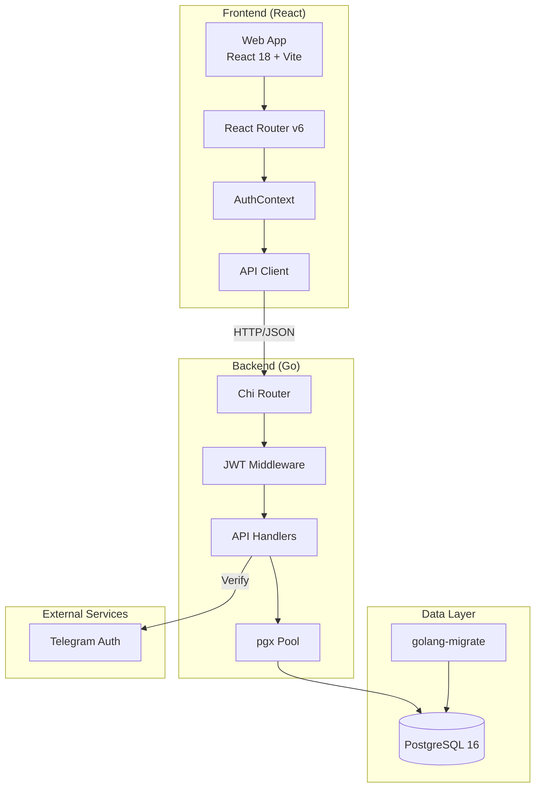
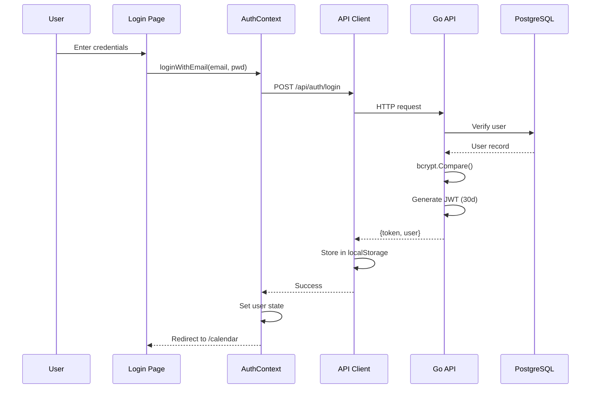
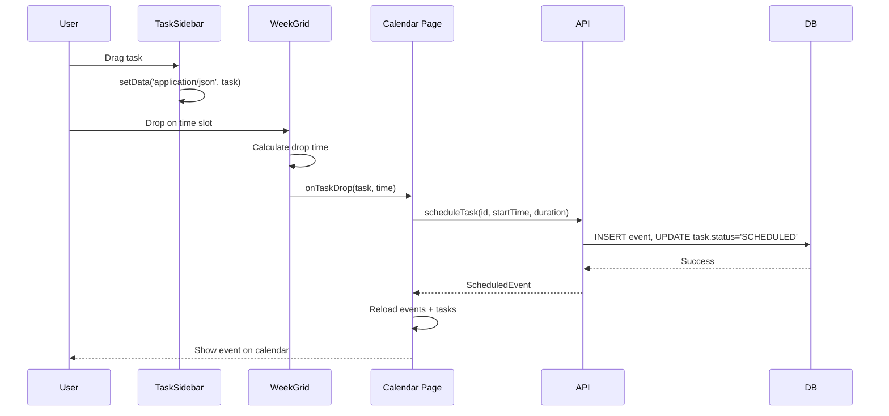
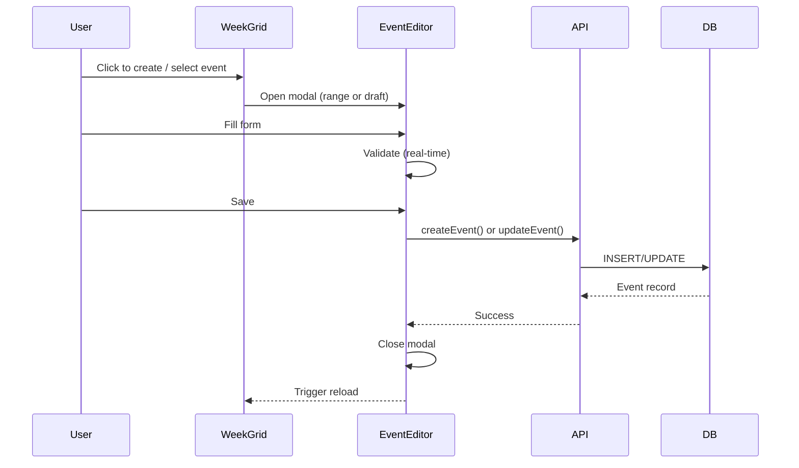

# Codebase Map

> Auto-generated by Cartographer. Last mapped: 2026-01-21
>
> 🔴 **Сверено 2026-08-10: инвентарь устарел, диаграммы и конвенции — нет.**
> Читать ради потоков данных, конвенций и «рецептов» (как добавить endpoint / страницу /
> миграцию). НЕ читать ради состава: миграций 10, а не 6; модуль `bot/` здесь отсутствует
> вовсе; карточка `auth/` описывает удалённые `db.go`/`jwt.go`/`telegram.go`; `planning` и
> `reflections` числятся 501-заглушками — оба реализованы полностью. Что чему верить —
> `docs/DOCS-MAP.md`.

## System Overview



## Directory Structure

```
neuroboost/
├── api-go/                      # Go backend API
│   ├── cmd/
│   │   ├── api/main.go         # Entry point, routes (lines 54-124)
│   │   └── healthcheck/        # Docker health check binary
│   ├── internal/
│   │   ├── auth/               # JWT + Telegram + email auth
│   │   ├── config/             # Environment config loader
│   │   ├── database/           # pgx connection pool
│   │   ├── events/             # Calendar events CRUD [IMPLEMENTED]
│   │   ├── tasks/              # Task management CRUD [IMPLEMENTED]
│   │   ├── feedback/           # User feedback system [IMPLEMENTED]
│   │   ├── middleware/         # JWT validation
│   │   ├── status/             # Health check endpoint
│   │   ├── util/               # Response helpers
│   │   └── (stubs)/            # needs, opportunities, patterns, planning, reflections
│   └── migrations/             # 6 PostgreSQL migrations
├── web/                         # React frontend
│   ├── src/
│   │   ├── api/                # HTTP client + API modules
│   │   ├── components/
│   │   │   ├── Calendar/       # WeekGrid + EventEditor [COMPLEX]
│   │   │   ├── Layout/         # Header variants
│   │   │   ├── TaskSidebar/    # Drag-to-calendar tasks
│   │   │   ├── FeedbackButton/ # Bug reporting
│   │   │   └── (stubs)/        # Planning views, tools
│   │   ├── contexts/           # AuthContext, ThemeContext
│   │   ├── pages/              # Route components
│   │   ├── hooks/              # Custom React hooks
│   │   └── types/              # TypeScript definitions
│   └── nginx.conf              # SPA routing config
├── docs/                        # Documentation
├── scripts/                     # Deployment scripts
├── docker-compose.yml          # 3-service orchestration
└── .github/workflows/ci.yml    # CI/CD pipeline
```

## Module Guide

### Backend: `api-go/internal/auth/`

**Purpose**: Authentication and user management (JWT + Telegram + email/password)

**Entry point**: `handlers.go`

**Key files**:
| File | Purpose | Tokens |
|------|---------|--------|
| handlers.go | HTTP handlers (Login, Register, Me, UpdateMe) | 5003 |
| types.go | User, Claims, request/response types | 853 |
| telegram.go | HMAC-SHA256 verification | 512 |
| jwt.go | Token generation (legacy) | 576 |
| db.go | User DB operations (legacy) | 1344 |

**Exports**: `Handler`, `NewHandler(db, cfg)`, `TelegramLogin`, `Register`, `Login`, `Me`, `UpdateMe`

**Dependencies**: `golang-jwt/jwt/v5`, `golang.org/x/crypto/bcrypt`, `jackc/pgx/v5`

**Dependents**: `cmd/api/main.go`

**Gotchas**:
- Telegram auth expires after 24 hours from `auth_date`
- JWT tokens have 30-day expiration
- Timezone validation limited to 6 hardcoded values
- `db.go` and `jwt.go` are legacy (handlers.go uses pgx directly)

---

### Backend: `api-go/internal/events/`

**Purpose**: Calendar event CRUD with move/resize/recurrence support

**Entry point**: `handlers.go`

**Key files**:
| File | Purpose | Tokens |
|------|---------|--------|
| handlers.go | Full CRUD + move/resize/exceptions | 5277 |
| types.go | Event, CreateRequest, UpdateRequest | 834 |

**Exports**: `InitDB(db)`, `ListHandler`, `CreateHandler`, `GetHandler`, `UpdateHandler`, `DeleteHandler`, `MoveHandler`, `ResizeHandler`, `AddExceptionHandler`

**Dependencies**: `go-chi/chi/v5`, `jackc/pgx/v5`, `internal/middleware`, `internal/util`

**Patterns**:
- Package-level DB variable (call `InitDB()` before use)
- Dynamic SQL query building for partial updates
- RFC3339 date parsing

**Gotchas**:
- Default timezone: "Europe/Moscow"
- Tags/contexts default to `[]`, never `null`
- `is_work_event` defaults to `true`
- Recurring events use iCalendar RRULE format

---

### Backend: `api-go/internal/tasks/`

**Purpose**: Task management with scheduling to calendar

**Entry point**: `handlers.go`

**Key files**:
| File | Purpose | Tokens |
|------|---------|--------|
| handlers.go | CRUD + schedule-to-event | 4315 |
| types.go | Task, TaskStatus, TaskCategory | 824 |

**Exports**: `InitDB(db)`, `ListHandler`, `CreateHandler`, `GetHandler`, `UpdateHandler`, `DeleteHandler`, `ScheduleHandler`

**Patterns**:
- Status changes trigger side effects (DONE sets `completed_at`)
- `ScheduleHandler` creates event AND updates task status to SCHEDULED

**Gotchas**:
- Priority 1 = Emergency (highest), Priority 5 = If Possible (lowest), Priority 0 = Buffer
- Contexts are GTD-style (`@home`, `@work`, `@computer`)
- Energy scale: 1-5

---

### Frontend: `web/src/api/client.ts`

**Purpose**: Core HTTP client with token management

**Key exports**:
- Token: `getStoredToken()`, `setStoredToken()`, `clearStoredToken()`, `isTokenExpired()`
- HTTP: `api.get()`, `api.post()`, `api.patch()`, `api.delete()`
- Inline APIs: Events, Tasks, Reflections (duplicated from separate modules)

**Patterns**:
- Automatic 401 redirect to `/login` with token clearing
- Response unwrapping (handles `{data: T}` and bare `T`)
- Token stored in localStorage (`nb_token`, `nb_token_expiry`)

**Gotchas**:
- API base URL from `VITE_API_URL` (defaults to `/api`)
- 204 responses return `{}`
- **Contains duplicate implementations** - Events/tasks APIs exist both here and in separate modules

---

### Frontend: `web/src/contexts/AuthContext.tsx`

**Purpose**: Global authentication state and session management

**Exports**: `AuthProvider`, `useAuthContext()`, `useRequireAuth()`, `useRequireAdmin()`

**State**:
- `user`, `loading`, `isAuthenticated`
- Settings synced to localStorage for non-React consumers

**Patterns**:
- Async session restoration on mount (checks token, fetches user)
- Custom DOM events for cross-component updates (`neuroboost-layout-change`)

**Gotchas**:
- Token expiry stored as Unix seconds, compared with `Date.now()` (milliseconds)
- No automatic token refresh - user logged out on expiry

---

### Frontend: `web/src/components/Calendar/WeekGrid/`

**Purpose**: Interactive weekly calendar with drag-and-drop

**Key files** (17 total):
| File | Purpose | Tokens |
|------|---------|--------|
| WeekGrid.tsx | Main orchestrator | 1897 |
| DayColumn.tsx | Single day rendering | 1688 |
| AllDaySection.tsx | All-day events | 1699 |
| GhostPreview.tsx | Drag feedback | 1776 |
| useWeekGridDrag.ts | Drag state management | 1246 |
| weekgrid.utils.ts | Position/time conversions | 1347 |
| useKeyboardNav.ts | Keyboard shortcuts | 826 |

**Props**:
```typescript
{
  events: NbEvent[]
  timezone: string
  onCreate: (data) => void
  onMoveOrResize: (data) => void
  onSelect: (event) => void
  onTaskDrop?: (task, startTime) => void
}
```

**Patterns**:
- Multi-day events split into segments with visual continuity
- Timezone-aware rendering (UTC storage, local display)
- Responsive: 1 day (mobile), 3 days (tablet), 7 days (desktop)
- Task drop from sidebar via `dataTransfer` JSON

**Gotchas**:
- Week starts Monday (ISO standard)
- `HOUR_PX = 44`, `MIN_SLOT_MIN = 15` (snap interval)
- Keyboard: Arrow keys navigate, Shift+Arrow moves events

---

### Frontend: `web/src/components/Calendar/EventEditor/`

**Purpose**: Modal form for event creation/editing with reflections

**Key files** (10 total):
| File | Purpose | Tokens |
|------|---------|--------|
| EventEditor.tsx | Main form orchestrator | 1089 |
| useEditorForm.ts | 20+ state fields, validation | 1992 |
| editor.utils.ts | UTC/local conversions | 1321 |
| DateTimeFields.tsx | Date/time inputs | 712 |
| ReflectionFields.tsx | Post-event metrics | 744 |

**Patterns**:
- Flexible time input parser (handles "1050", "10:50", "9:30")
- Cross-midnight event detection
- Conditional UI (advanced toggle, reflection only for editing)

**Gotchas**:
- All UTC/local conversions in `editor.utils.ts`
- Enter to save, Ctrl+Enter in description textarea

---

### Frontend: `web/src/router.tsx`

**Purpose**: Application routing configuration

**Routes**:
- Public: `/login`, `/home`
- Protected: `/calendar`, `/tasks`, `/planning`, `/reflections`, `/tools`, `/settings`, `/profile`, `/admin`
- Default: `/` redirects to `/home`

**Patterns**:
- `ProtectedRoute` wrapper checks `isAuthenticated`
- `PublicRoute` redirects authenticated users to `/home`

---

## Data Flow

### Authentication Flow



### Task Scheduling Flow



### Event CRUD Flow



## Conventions

### Backend
- **Handler pattern**: Each package exports HTTP handlers
- **Package-level DB**: Events/tasks use `InitDB(db)` instead of constructor injection
- **Dynamic SQL**: All updates build query based on provided fields
- **Response envelope**: `{data, error, meta}` via `util.RespondJSON/RespondError`
- **Pointer fields**: Optional fields are pointers for nullability

### Frontend
- **Context API**: Global state via AuthContext, ThemeContext
- **Type conversion**: API (snake_case) ↔ Frontend (camelCase) via `toNbEvent()`
- **Loading states**: Spinner during async operations
- **Modal pattern**: Fixed overlay, click-outside close, Escape key

### Naming
- **Go files**: lowercase with underscores (`handlers.go`, `db.go`)
- **React components**: PascalCase (`EventEditor.tsx`)
- **React hooks**: camelCase with `use` prefix (`useEditorForm.ts`)
- **TypeScript types**: PascalCase (`NbEvent`, `Task`)

## Gotchas

### Critical
1. **Duplicate `toNbEvent()`** exists in 3 places with different implementations (`client.ts`, `events.ts`, `types/index.ts`)
2. **Dual Claims structs** in `auth/types.go` vs `middleware/jwt.go`
3. **Legacy files** in auth package (`db.go`, `jwt.go`) not used by current handlers
4. **Token expiry mismatch**: Stored as Unix seconds, compared with `Date.now()` (milliseconds)

### Non-obvious
- Default timezone throughout: "Europe/Moscow"
- Priority inversion: Lower number = higher priority (1=Emergency, 5=If Possible)
- Task scheduling creates event but doesn't delete task
- All arrays default to `[]`, never `null`
- Week starts Monday (ISO standard)

### Stubs (Return 501)
- Backend: needs, opportunities, patterns, planning, reflections
- Frontend: All planning views, tool views, most hooks

## Navigation Guide

**To add a new API endpoint**:
1. Add route in `api-go/cmd/api/main.go` (lines 54-124)
2. Create handler in `api-go/internal/{module}/handlers.go`
3. Add types in `api-go/internal/{module}/types.go`
4. Add API function in `web/src/api/{module}.ts`

**To add a new page**:
1. Create page component in `web/src/pages/{Page}/{Page}.tsx`
2. Add route in `web/src/router.tsx`
3. Add navigation item in `web/src/components/Layout/Header/HorizontalHeader.tsx` (line ~30)

**To add a new migration**:
1. Create `api-go/migrations/NNNNNN_name.up.sql` and `.down.sql`
2. Migrations run automatically on API container startup

**To modify auth**:
1. Backend: `api-go/internal/auth/handlers.go`
2. Middleware: `api-go/internal/middleware/jwt.go`
3. Frontend: `web/src/contexts/AuthContext.tsx`
4. API client: `web/src/api/auth.ts`

**To add a calendar feature**:
1. WeekGrid: `web/src/components/Calendar/WeekGrid/`
2. EventEditor: `web/src/components/Calendar/EventEditor/`
3. Calendar page: `web/src/pages/Calendar/Calendar.tsx`

**To add a task feature**:
1. Backend: `api-go/internal/tasks/handlers.go`
2. Frontend API: `web/src/api/tasks.ts`
3. TaskSidebar: `web/src/components/TaskSidebar/`
4. Tasks page: `web/src/pages/Tasks/Tasks.tsx`
